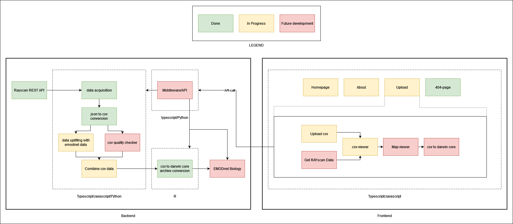

# Project Name: EMODnet Quality Check

## Overview

This project is a full-stack web application that allows users to upload a CSV file with temporal, geolocation, and species data. The backend workflow then retrieves additional data from EMODnet to insert bathymetry and occurrence data, together with temperature data for the geolocations and species data given. This is used as a quality check of the data, and finally, the combined data can be packaged as a Darwin Core Archive file and be sent to EMODnet for injection into their database.

## Pre-requisites

-   [Node.js](https://nodejs.org/en/) (v14.15.4)
-   [npm](https://www.npmjs.com/) (v6.14.10)
-   [Python](https://www.python.org/) (v3.8.5)
-   [pip](https://pypi.org/project/pip/) (v20.2.4)
-   [react](https://reactjs.org/) (v17.0.1)

## Installation

### Backend

1.  Clone the repository
2.  Navigate to the backend folder
3.  Create a virtual environment with `python -m venv venv`
4.  Activate the virtual environment with `source venv/bin/activate`
5.  Install the required packages with `pip install -r requirements.txt`
6.  Run the backend with `python app.py`

### Frontend

1.  Navigate to the frontend folder
2.  Install the required packages with `npm install`
3.  Run the frontend with `npm start`

## Usage

### Backend

The backend is a Flask application that runs on port 5000. It has the following endpoints:

-   `/` - The home page
-   `/upload` - The upload page
-   `/upload/<filename>` - The upload page with a filename pre-filled
-   `/download/<filename>` - The download page with a filename pre-filled
-   `/api/upload` - The API endpoint for uploading a file
-   `/api/download` - The API endpoint for downloading a file

### Frontend

The frontend is a React application that runs on port 3000. It has the following pages:

-   `/` - The home page
-   `/upload` - The upload page
-   `/about` - The about page
-   `/404` - The 404 page

### UML Diagram of the whole application

## For developpers

## Getting Started with Create React App

This project was bootstrapped with [Create React App](https://github.com/facebook/create-react-app).

### Available Scripts

In the project directory, you can run:

#### `npm start`

Runs the app in the development mode.\
Open [http://localhost:3000](http://localhost:3000) to view it in the browser.

The page will reload if you make edits.\
You will also see any lint errors in the console.

#### `npm test`

Launches the test runner in the interactive watch mode.\
See the section about [running tests](https://facebook.github.io/create-react-app/docs/running-tests) for more information.

#### `npm run build`

Builds the app for production to the `build` folder.\
It correctly bundles React in production mode and optimizes the build for the best performance.

The build is minified and the filenames include the hashes.\
Your app is ready to be deployed!

See the section about [deployment](https://facebook.github.io/create-react-app/docs/deployment) for more information.

#### `npm run eject`

**Note: this is a one-way operation. Once you `eject`, you can’t go back!**

If you aren’t satisfied with the build tool and configuration choices, you can `eject` at any time. This command will remove the single build dependency from your project.

Instead, it will copy all the configuration files and the transitive dependencies (webpack, Babel, ESLint, etc) right into your project so you have full control over them. All of the commands except `eject` will still work, but they will point to the copied scripts so you can tweak them. At this point you’re on your own.

You don’t have to ever use `eject`. The curated feature set is suitable for small and middle deployments, and you shouldn’t feel obligated to use this feature. However we understand that this tool wouldn’t be useful if you couldn’t customize it when you are ready for it.

### Learn More

You can learn more in the [Create React App documentation](https://facebook.github.io/create-react-app/docs/getting-started).

To learn React, check out the [React documentation](https://reactjs.org/).
